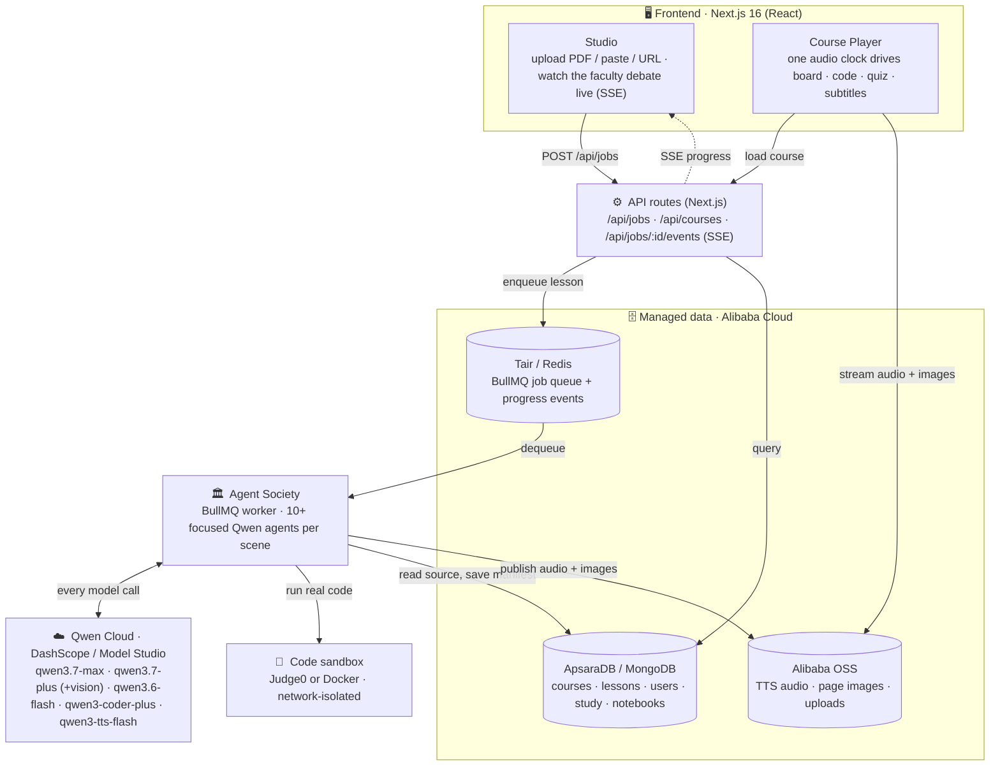
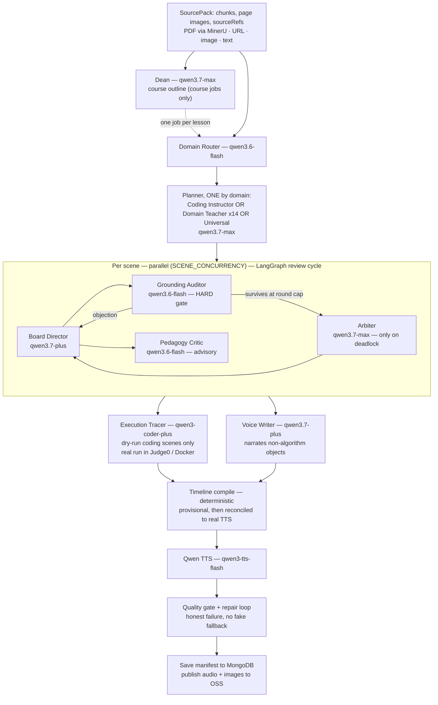

<div align="center">

# ◎ Forever

### An agent society that teaches like the best teacher you ever had

**Bring any material — a PDF, an article, notes, a photo of a slide — and a society of Qwen
agents turns it into a narrated, interactive course** where algorithms are animated from
*really-executed code*, every claim is cited to your source, and the student edits and runs the
lesson's code themselves.


**Global AI Hackathon with Qwen Cloud · Track 3: Agent Society** — all intelligence on
**Qwen Cloud (DashScope / Alibaba Cloud Model Studio)**, deployed on Alibaba Cloud ECS.

[**Highlights**](#-highlights) · [**Product tour**](#1--paste-anything--a-faculty-of-ai-teachers-builds-a-full-course) · [**Architecture**](#architecture) · [**Track 3 mapping**](#track-3-agent-society--how-it-maps) · [**Run it**](#run-it) · [**Deep docs →** `forever/`](forever/)

</div>


## ✨ Highlights

- 🏛️ **A real agent society, not one mega-prompt** — 10+ specialized Qwen agents per scene divide the work and debate on a shared blackboard; a per-scene **LangGraph** cycle runs propose → audit → revise, and an **Arbiter** breaks deadlocks.
- ▶️ **Algorithms animated from *really-executed* code** — every trace runs for real in a sandbox (Judge0 / Docker); no LLM-imagined frames. Students re-run the exact code in-browser.
- 🔎 **Grounded-or-dropped** — every board claim cites a source chunk; an independent auditor blocks the unsupported; figures carry a **"Source · page N"** stamp.
- 📊 **Measured, not claimed** — same material through the society vs a single-agent baseline: **4/4 vs 0/4** on the quality gate ([`forever/eval/`](forever/eval/)).
- ☁️ **All-Qwen & production-shaped** — one model per job on DashScope, BullMQ workers, MongoDB, OSS, honest failures (no fake fallbacks), **660+ tests**.

> **📁 The full source, architecture, and benchmarks live in [`forever/`](forever/).** This page
> is the complete product tour; [`forever/README.md`](forever/README.md) has the deep technical docs.

---

## The problem

Every month, students pay for courses — Coursera, Udemy, one subscription after another — and
finish almost none of them; you pay whether you study or not. And when an exam is close, you fall
back on your **own university slides and PDFs: dense, wordy, and nearly impossible to understand
alone.** The AI tools that promise to help just ask **one model to imagine a lesson** — so the
"facts" are hallucinated, the algorithm animations are made-up frames, and you're still only
*watching*.

## How Forever answers it

Forever turns **your own material** — the exact slides and PDFs you're stuck on — into a course
taught by a **society of Qwen agents**, and you **pay only for what you actually generate**, not a
monthly subscription for content you never open.

- 🎓 A **Dean** and a domain **Teacher** turn your slides into a real lesson plan.
- 🖊️ A **Board Director** writes it on a board **in sync with a spoken voice** — like a human tutor explaining, not a wall of text.
- 🔎 A **Grounding Auditor** objects, *with evidence*, to anything your source doesn't support; an **Arbiter** settles the dispute. **Grounded-or-dropped — no hallucinations.**
- ⚙️ An **Execution Tracer** *runs the real code*, so every algorithm animation is true to an actual run — never imagined — and you can edit and run it yourself.

**That's the real innovation** — not "PDF → summary" (many tools do that), but a **team of AI
agents that divide the work, debate with citations, and execute real code**, so what you learn is
provably correct. It maps directly to Track 3: task division, dialogue, conflict resolution, and a
measured **4/4 vs 0/4** gain over a single-agent baseline.

## 1 · Paste anything → a faculty of AI teachers builds a full course

Text, a PDF (figures & pages included), a URL, or an image. The **Dean** plans the episodes and
lessons; the first lesson generates immediately, the rest on demand.


A full multi-episode course, generated end-to-end — each lesson typed **Concept / See it /
Build / Practice**, each with a quiz.


## 2 · The signature feature — algorithms animated from *really-executed* code

The engine runs the algorithm **for real in a sandbox** (Judge0 or Docker) — the traced program
emits structured step events as it executes — and drives the screen from that recording: the
grid, the **highlighted active line**, node state, and a step-by-step trace table are all
reconciled to the run. The student can re-run the exact code in their own browser (CPython / WASM).

**Flood-fill / DFS** — grid cells fill as the recursion sinks each island, the code panel marks
the live line, the trace table logs every call:


**Dijkstra on a 6-node graph** — nodes carry per-node state (current / visited / not-yet /
crossing / walked), edges light as they relax, all synced to the code and the voice:


**Every lesson is signed by the society** — "generated by the agent society", with the debate
receipt (`12 steps · 9 objections · 1 repair · verified ✓`) and per-claim source citations.


Recap scenes are written on a **handwritten board** — the tutor's own summary, in its own hand:


## 3 · Grounded in *your* source — figures and claims are cited, never invented

Real figures are lifted from the uploaded PDF and shown with a **"Source · page N"** stamp; an
independent Grounding Auditor blocks anything the source doesn't support.


## 4 · The student *does*, not just watches

Interactive scenes ask you to **predict first**, then manipulate — drag the decision threshold
and watch the confusion matrix move against your prediction:


## 5 · Remember it forever — spaced repetition + a forgetting model

Progress models **what you'll forget and when**, schedules reviews, and shows the best next step.


## 6 · Your second brain — notebooks that write back

Collect anything; the notebook responds with grounded notes, summaries, quizzes, **dry runs**,
and handwritten "visual notes".


## 7 · Two bonus tools shipped

**Focus Guard** (Chrome extension) — Qwen vision detects when you drift from studying and writes a
specific, goal-aware nudge to pull you back.


**Audio → Notes** — live in-class transcription turned into clean, structured study notes.


---

## Architecture

### System — how frontend, backend, database, and Qwen Cloud connect

One repo, **two processes**: the Next.js app serves the Studio/Player/API; a **separate BullMQ
worker** runs the agent society. `POST /api/jobs` enqueues and returns `202 { jobId }` — nothing
generates inline — and the Studio streams the faculty's live debate back over SSE. Every model
call goes to **Qwen Cloud**; all persistent state lives in **Alibaba Cloud** managed services.



### The agent society — the real generation pipeline

The orchestrator is **deterministic code** (BullMQ + a LangGraph state machine); intelligence
lives in the agents. The **Dean** runs only for course jobs (fans out one job per lesson). Per
lesson, the **Domain Router** picks **one** planner — the Coding Instructor, one of 14 domain
Teachers, or the Universal Teacher. Each scene is then produced in parallel, and the
board goes through a **real LangGraph review cycle**: propose → audit → revise → (arbitrate).



## Track 3: Agent Society — how it maps

- **Task division** — each agent has one focused job with its own schema, under
  [`forever/lib/orchestration/agents/`](forever/lib/orchestration/agents/): a Router picks the
  planner; a Board Director stages each scene; independent critics review it; an Execution
  Tracer runs real code; a Voice Writer narrates; deterministic code compiles the timeline.
- **Dialogue & negotiation** — every scene has a **blackboard** with an append-only, typed
  message log (proposal / objection / evidence / revision / verdict). The **Grounding Auditor is
  a hard gate**, the **Pedagogy Critic is advisory**; both run in parallel and the Board
  Director revises against their objections. An objection without evidence is rejected — debates
  stay grounded, not rhetorical. The whole log streams live to the Studio over SSE.
- **Conflict resolution** — bounded (`MAX_DEBATE_ROUNDS`): if grounding objections still survive
  at the round cap, the **Arbiter** issues a binding verdict (strict-consensus fallback if its
  own call fails). Only the failed stage re-runs, never the whole scene. Structurally, a dry-run
  scene without a real execution trace refuses to ship — no fabricated animation.
- **Measurable gain vs single-agent baseline** — [`forever/eval/`](forever/eval/): the same
  SourcePack runs through a single `qwen3.7-max` mega-prompt vs the full society. On N=4 matched
  coding materials the single agent passes **0/4** the quality gate; the society passes **4/4**
  with 0 contract failures and 3–5× depth.

### Model routing (one model per job — all on Qwen Cloud)

| Agent | Model | Why |
|---|---|---|
| Dean · Teacher · Coding Instructor · Arbiter | `qwen3.7-max` | long-horizon planning & binding verdicts |
| Board Director · Voice Writer | `qwen3.7-plus` | multimodal scene authoring (sees page images) |
| Domain Router · Grounding Auditor · Pedagogy Critic | `qwen3.6-flash` | fast classify & review |
| Execution Tracer · Code Runner | `qwen3-coder-plus` | writes the programs that emit real traces |
| Page-image vision | `qwen3.7-plus` | region/diagram/transcription reading |
| Voice (TTS) | `qwen3-tts-flash` | natural tutor narration |

## How Forever meets the judging criteria

| Criterion | How Forever delivers |
|---|---|
| **Technical Depth & Engineering** (30%) | Custom society kernel + a real **LangGraph** review cycle; a universal execution tracer (17 behavioral detectors, real sandbox runs) that never lets the AI author a runtime fact; a deterministic timeline reconciled to real **TTS word offsets**; a region-DSL board renderer. Structured Outputs + prompt-cache-per-episode on Qwen Cloud. |
| **Innovation & AI Creativity** (30%) | Grounded-or-dropped debate as the quality gate; algorithms drawn from **real execution**, not imagined frames; one-model-per-job routing; honest failure over silent degradation. |
| **Problem Value & Impact** (25%) | Turns *any* material into a taught, interactive course — solving passive, hallucination-prone AI courseware. Open-source (AGPL-3.0), horizontally scalable (BullMQ), productizable. |
| **Presentation & Documentation** (15%) | This README + two architecture diagrams + [`forever/eval/RESULTS.md`](forever/eval/) benchmark + a 3-minute demo; the Studio literally streams the faculty's debate live. |

## Qwen Cloud / Alibaba Cloud (deployment proof)

- **Every model call goes to Qwen Cloud (DashScope / Model Studio)** through one client:
  [`forever/lib/qwen/client.js`](forever/lib/qwen/client.js) — endpoint
  `dashscope-intl.aliyuncs.com/compatible-mode/v1` (qwen3.7-max planners/judge, qwen3.7-plus
  board/vision, qwen3.6-flash routing/audit, qwen3-coder-plus tracer programs), plus the Qwen
  TTS adapter [`forever/lib/tts/providers/synthesize.js`](forever/lib/tts/providers/synthesize.js).
- Backend on **Alibaba Cloud ECS**; **MongoDB** (ApsaraDB-compatible), **Redis/BullMQ**
  (Tair-compatible), media to **OSS** behind the storage seams in
  [`forever/lib/storage/`](forever/lib/storage/).
- **Deploy it:** containerized ([`forever/Dockerfile`](forever/Dockerfile),
  [`forever/docker-compose.yml`](forever/docker-compose.yml)) with a step-by-step ECS runbook —
  [`forever/infra/deploy-alibaba-ecs.md`](forever/infra/deploy-alibaba-ecs.md) — and a one-command
  [`forever/infra/deploy.sh`](forever/infra/deploy.sh).

## Run it

```bash
cd forever && npm install
cp .env.example .env        # set DASHSCOPE_API_KEY, MONGODB_URI, REDIS_URL, SESSION_SECRET
docker pull python:3.12-slim node:22-slim   # the code sandbox

npm run dev:all             # web on :3000 (+ the Focus-Guard server on :3001)
npm run worker              # the agent society — separate process, needs REDIS_URL
npm test                    # 660+ tests, no tokens spent
```

> Without `REDIS_URL`, generation falls back to an in-process queue (handy for local dev/tests);
> with it, `npm run worker` runs the BullMQ society and scales horizontally.

Deep-dive docs, the universal dry-run engine, the full benchmark table, and the repository map:
**[`forever/README.md`](forever/README.md)**. Devpost submission text and demo-video script:
[`forever/SUBMISSION.md`](forever/SUBMISSION.md).

---

<div align="center">

*This monorepo also holds earlier experiments and research — the hackathon submission is the
**[`forever/`](forever/)** project only.*

</div>
