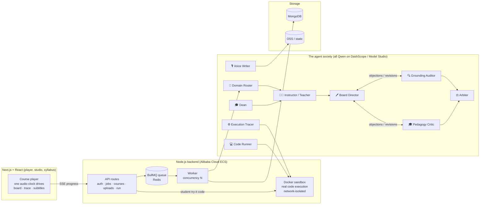

<div align="center">

# ◎ Forever

### An agent society that teaches like the best teacher you ever had

**Bring any material — a PDF, an article, notes, a photo of a slide — and a society of Qwen
agents turns it into a narrated, interactive course** where algorithms are animated from
*really-executed code*, every claim is cited to your source, and the student edits and runs the
lesson's code themselves.

**Global AI Hackathon with Qwen Cloud · Track 3: Agent Society**
`AGPL-3.0` · all models on **Qwen Cloud (DashScope / Alibaba Cloud Model Studio)** · Next.js · Node.js worker · Docker sandbox · MongoDB · Redis

</div>


> **📁 The full source, architecture, and benchmarks live in [`forever/`](forever/).** This page
> is the complete product tour; [`forever/README.md`](forever/README.md) has the deep technical docs.

---

## The problem

Most "AI course" tools ask **one model to imagine a lesson** — so algorithm animations are
made-up frames, "facts" are hallucinated, and the student just watches. Forever replaces the
single model with a **society of specialized Qwen agents that divide the work, argue with
evidence, and refuse to ship anything they can't prove** — and it drives every algorithm
animation from a *real* code execution, not a guess.

## 1 · Paste anything → a faculty of AI teachers builds a full course

Text, a PDF (figures & pages included), a URL, or an image. The **Dean** plans the episodes and
lessons; the first lesson generates immediately, the rest on demand.


A full multi-episode course, generated end-to-end — each lesson typed **Concept / See it /
Build / Practice**, each with a quiz.


## 2 · The signature feature — algorithms animated from *really-executed* code

The engine records ONE real execution (`sys.settrace`) and drives the screen from it: the grid,
the **highlighted active line**, node state, and a step-by-step trace table are all reconciled to
the run. The student can re-run the exact code in their own browser (CPython / WebAssembly).

**Flood-fill / DFS** — grid cells fill as the recursion sinks each island, the code panel marks
the live line, the trace table logs every call:


**Dijkstra on a 6-node graph** — nodes carry per-node state (current / visited / not-yet /
crossing / walked), edges light as they relax, all synced to the code and the voice:


**Every lesson is signed by the society** — "generated by the agent society", with the debate
receipt (`12 steps · 9 objections · 1 repair · verified ✓`) and per-claim source citations.


Recap scenes are written on a **handwritten board** — the tutor's own summary, in its own hand:


## 3 · Grounded in *your* source — figures and claims are cited, never invented

Real figures are lifted from the uploaded PDF and shown with a **"Source · page N"** stamp; an
independent Grounding Auditor blocks anything the source doesn't support.


## 4 · The student *does*, not just watches

Interactive scenes ask you to **predict first**, then manipulate — drag the decision threshold
and watch the confusion matrix move against your prediction:


## 5 · Remember it forever — spaced repetition + a forgetting model

Progress models **what you'll forget and when**, schedules reviews, and shows the best next step.


## 6 · Your second brain — notebooks that write back

Collect anything; the notebook responds with grounded notes, summaries, quizzes, **dry runs**,
and handwritten "visual notes".


## 7 · Two bonus tools shipped

**Focus Guard** (Chrome extension) — Qwen vision detects when you drift from studying and writes a
specific, goal-aware nudge to pull you back.


**Audio → Notes** — live in-class transcription turned into clean, structured study notes.


---

## Architecture



## Track 3: Agent Society — how it maps

- **Task division** — every agent has one job, one file under
  [`forever/lib/orchestration/agents/`](forever/lib/orchestration/agents/) (router, dean,
  instructor, board director, execution tracer, code runner, voice writer, grounding auditor,
  pedagogy critic, arbiter).
- **Dialogue & negotiation** — the Board Director proposes; the Auditor and Critic object with
  cited evidence; the board revises; a bounded debate ends in an Arbiter verdict —
  grounded-or-dropped.
- **Conflict resolution** — structural: hand-authored animation is stripped so the real trace
  owns motion; a dry-run scene without a real trace refuses to ship.
- **Measurable gain vs single-agent baseline** — [`forever/eval/`](forever/eval/): on N=4
  matched coding materials a single agent passes **0/4** the quality gate; the society passes
  **4/4** with 0 contract failures and 3–5× depth.

## Qwen Cloud / Alibaba Cloud (deployment proof)

- **Every model call goes to Qwen Cloud (DashScope / Model Studio)** through one client:
  [`forever/lib/qwen/client.js`](forever/lib/qwen/client.js) — endpoint
  `dashscope-intl.aliyuncs.com/compatible-mode/v1` (qwen3.7-max planners/judge, qwen3.7-plus
  board/vision, qwen3.6-flash routing/audit, qwen3-coder-plus tracer programs), plus the Qwen
  TTS adapter [`forever/lib/tts/providers/synthesize.js`](forever/lib/tts/providers/synthesize.js).
- Backend on **Alibaba Cloud ECS**; **MongoDB** (ApsaraDB-compatible), **Redis/BullMQ**
  (Tair-compatible), media to **OSS** behind the storage seams in
  [`forever/lib/storage/`](forever/lib/storage/).

## Run it

```bash
cd forever && npm install
cp .env.example .env        # set DASHSCOPE_API_KEY, MONGODB_URI, REDIS_URL, SESSION_SECRET
docker pull python:3.12-slim node:22-slim
npm run dev:all             # web (3000) + worker
npm test                    # 660+ tests, no tokens spent
```

Deep-dive docs, the universal dry-run engine, the full benchmark table, and the repository map:
**[`forever/README.md`](forever/README.md)**. Devpost submission text and demo-video script:
[`forever/SUBMISSION.md`](forever/SUBMISSION.md).

---

<div align="center">

*This monorepo also holds earlier experiments and research — the hackathon submission is the
**[`forever/`](forever/)** project only.*

</div>
