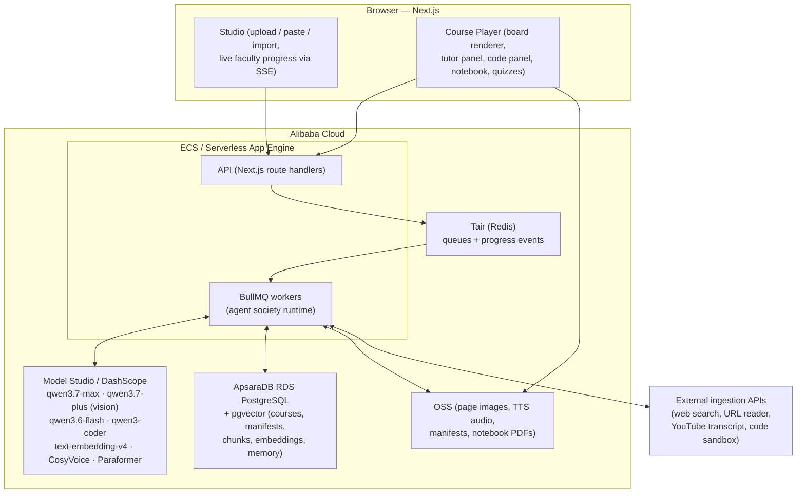

# Forever — Production Architecture

**Product:** Forever turns any learning material (PDF, notes, article, YouTube transcript, code, syllabus, research paper, or a bare topic name) into a Udemy-style tutor course-series: episodes → lessons → scenes, with a tutor voice that explains step by step, writes on a board, points at evidence, runs code, quizzes the student, and saves notebook pages.

**Hackathon target:** Global AI Hackathon with Qwen Cloud — **Track 3: Agent Society**. The generation engine is a faculty of specialized Qwen agents that divide work, debate, negotiate, and repair each other's output — with a benchmark proving a measurable quality/efficiency gain over a single-agent baseline.

**What Forever is NOT:** not a chatbot, not a slide generator, not AI-generated video. There is no video file. The "video feeling" is a **clock-driven playback engine**: one audio clock drives handwriting-style board writing, pointer movement, code highlighting, subtitles, and quiz reveals — like OpenMAIC. The tutor panel is a pre-made avatar asset (looping idle/talking states), never generative video.

---

## 1. Non-Negotiable Rules

1. Visual agents never output raw `x/y` coordinates. They output `layout`, `region`, and `line_number`. The renderer resolves regions to pixels at play time (DOM-measured, correct on any screen size).
2. A manifest cannot be stored until it validates against the contract. Validation failure → repair loop → honest error. **No fake fallbacks, no placeholder content, ever.**
3. Playback is clock-driven. One audio clock; every visual action carries `startMs`/`durationMs` relative to it. The renderer never runs independent timers.
4. Agent-estimated timestamps are provisional. Production playback timing comes from TTS word alignment + the timestamp reconciler.
5. A course is a series: course outline → episodes → lessons → scenes. A one-scene demo is not the product.
6. Every factual claim on the board or in narration carries a `sourceRef` (chunk id + region) back to the SourcePack. Topic-name input builds its SourcePack via cited web research first — grounding is never skipped.
7. No single LLM call generates everything. Each agent has one focused job with its own schema.

---

## 2. System Overview



One repo, one deployment story: Next.js serves the player, studio, and API; BullMQ workers (same codebase, separate process) run the agent society; everything stateful lives in Alibaba Cloud managed services. LLM access goes exclusively through Qwen Cloud's OpenAI-compatible endpoint via `lib/qwen/`.

---

## 3. The Agent Society (Track 3 core)

The society is a **faculty** — named agents with distinct capabilities, a shared blackboard, and an explicit message protocol. The orchestrator is deterministic code (BullMQ jobs + state machine), not an LLM: control flow is auditable and resumable; intelligence lives in the agents.

### 3.1 Roster

| Agent | Model | Job |
|---|---|---|
| **Librarian** | qwen3.6-flash + qwen3.7-plus (vision) | Ingestion: adapters → SourcePack (chunks, page images, source refs). Vision pass reads every page image: transcribes, finds regions, diagrams, relationships. |
| **Researcher** | qwen3.7-plus + built-in `web_search`/`web_extractor` tools | Only for topic-name/thin input: searches, reads, and builds a *cited* SourcePack so grounding still holds. Uses Qwen Cloud's native Responses-API tools first; Tavily/Jina are fallbacks. |
| **Archivist** | text-embedding-v4 | Embeds chunks into pgvector; serves semantic retrieval to every other agent. |
| **Dean** | qwen3.7-max | Course outline: episodes, lessons, learning objectives, duration budgets — from the SourcePack concept graph. |
| **Domain Router** | qwen3.6-flash | Classifies domain (code / math / data / science / general) → picks the Teacher persona. |
| **Teacher** | qwen3.7-max (thinking) | Per lesson: pedagogy plan — scenes, teaching sequence, misconceptions, level coverage, which source regions each scene must use. |
| **Board Director** | qwen3.7-plus | Per scene: visual plan — layout template, regions, board objects (title, bullets, table, diagram spec, code block), each bound to a sourceRef. Multimodal: SEES the actual page images while planning, so the board mirrors the source. Regions only, never x/y. |
| **Voice Writer** | qwen3.7-plus | Per scene: narration lines bound to board objects and regions; conversational, step-by-step, human-teacher register. |
| **Code Runner** | qwen3-coder + sandbox | For code scenes: writes runnable examples, executes them for real, captures actual output and dry-run traces. Output shown is real output. |
| **Quiz Master** | qwen3.7-plus | Checkpoint questions with worked answers, each answerable from cited source regions. |
| **Notebook Scribe** | qwen3.6-flash | Compiles each lesson's board state into a saved notebook page (and PDF export). |
| **Review Board** | see 3.3 | Four critics + an Arbiter — quality gate before any manifest is stored. |
| **Timeline Compiler** | deterministic code | No LLM. Compiles board plan + voice lines into the timed action timeline (focus-before-speech, canvas safe zones, validation). |
| **Reconciler** | Paraformer ASR | Replaces provisional timings with real word offsets from the rendered TTS audio. |

### 3.2 Message protocol and blackboard

- Every scene under construction has a **blackboard workspace** (Postgres row + Redis pubsub): the evolving draft plus an append-only **conversation log** of typed messages: `proposal`, `objection`, `evidence`, `revision`, `verdict`, `handoff`.
- Every message that asserts a fact must carry `sourceRefs`. An objection without evidence is rejected by the runtime — this keeps debates grounded, not rhetorical.
- The Studio streams this log live over SSE: the user (and the judges) literally watch the faculty divide the work, argue, and converge. This is the demo's money shot.

### 3.3 Disagreement and negotiation (explicit, not decorative)

**Review Board debate.** Grounding Auditor, Pedagogy Critic, Sync Inspector, and Clutter Critic each score the scene against a rubric. Any failing critic files an `objection` with evidence. The producing agent gets one `revision` round per objection. If critic and producer still disagree after two rounds, the **Arbiter** (qwen3.7-max, sees only the contract, the evidence, and both arguments) issues a binding `verdict`. Only the failed stage re-runs — never the whole scene.

**Budget negotiation.** Board Director and Voice Writer share a per-scene time budget derived from the Dean's episode plan. If the Voice Writer's narration overruns the Board Director's visual pacing (or vice versa), the runtime opens a negotiation round: each proposes cuts/merges with justification; the Teacher persona arbitrates against the learning objectives. Resolved budgets are written to the blackboard as constraints.

**Scope negotiation.** If the Teacher wants more scenes than the Dean's episode budget allows, the Teacher must trade: propose splitting an episode or demoting a concept to "stretch" material. The Dean accepts or counters; the exchange is logged.

### 3.4 Society memory

The faculty accumulates experience across runs (also strengthens the submission story):
- **Rubric memory:** verdicts from the Arbiter are distilled (qwen3.6-flash) into reusable review heuristics, retrieved by critics on later scenes.
- **Learner memory:** quiz results and replayed segments feed back into the Teacher's next-lesson plan (remediation scenes).
Both stored in Postgres, retrieved via pgvector — bounded, with recency decay so stale rules expire.

### 3.5 Measurable gain over single-agent baseline (judging requirement)

`eval/` contains a benchmark harness that runs the **same SourcePack** through:
- **Baseline:** one qwen3.7-max mega-prompt producing a full scene manifest in one shot.
- **Society:** the full faculty pipeline.

Reported metrics (auto-generated table in `eval/RESULTS.md`): contract validation pass rate, grounding coverage (% board objects with resolving sourceRefs), region-discipline violations, quiz answerability (independent checker), timeline sync errors, repair convergence rounds, wall time, and token cost. The claim "society beats single agent" ships with numbers, not vibes.

---

## 4. Generation Pipeline (staged, validated, resumable)

```text
Input material
  -> ingestion adapters (pdf | text | url | youtube | code | syllabus | paper | topic)
  -> SourcePack: chunks + page images + source refs + concept graph   [Librarian / Researcher]
  -> embeddings into pgvector                                          [Archivist]
  -> course outline: episodes/lessons/objectives/budgets               [Dean]
  -> domain routing -> Teacher persona                                 [Domain Router]
  -> per lesson: pedagogy plan (scenes, sequence, regions to teach)    [Teacher]
  -> per scene (parallel BullMQ jobs):
       visual board plan (regions, objects, sourceRefs)                [Board Director]
       voice lines bound to objects/regions                            [Voice Writer]
       real code execution + captured output (code scenes)            [Code Runner]
       quiz items with worked answers                                  [Quiz Master]
  -> deterministic timeline compile (provisional timings)              [Timeline Compiler]
  -> TTS render (CosyVoice) -> word alignment (Paraformer)             [Reconciler]
  -> timeline timings replaced with real word offsets
  -> Review Board debate -> repair only the failed stage               [Review Board + Arbiter]
  -> manifest validated against @forever/contracts -> stored           [storage]
  -> notebook page compiled                                            [Notebook Scribe]
  -> course-series player streams manifest + audio from OSS
```

Every stage validates its output schema before the next stage runs. Every stage is a BullMQ job: crash-resumable, horizontally scalable, individually retryable.

---

## 5. Playback Engine

- **Manifest** = the compiled scene: board objects, regions, timed actions (`write`, `point`, `highlight`, `zoom`, `revealCode`, `showOutput`, `quiz`), voice lines, audio URL, subtitles, sourceRefs.
- **One clock:** `<audio>` element's `currentTime` is the only clock. The renderer binary-searches the action list every animation frame and renders the state at time *t* — which makes seek, scrub, replay, and playback-speed free.
- **Region resolution:** layout templates define named regions; objects address `region + line_number`; `getBoundingClientRect()` gives final pixels. Pointer accuracy is measured, not assumed.
- **Handwriting feel:** board text/diagrams animate stroke-by-stroke (SVG path reveal) at the pace of the narration words covering them.
- **Source & Proof panel:** original page image, untouched; evidence highlighted by bbox overlay; renderer zooms via CSS transforms — the source is never cropped.
- **Player chrome:** episode sidebar with progress, timeline thumbnails per scene, subtitles, 0.75–2× speed, quizzes that pause the clock, notebook autosave, PDF export, resume-where-you-left-off.

---

## 6. Technology Stack

| Layer | Choice | Why |
|---|---|---|
| Frontend + API | Next.js (App Router) + React | Player, Studio, API routes in one deployable |
| Board renderer | SVG + custom action engine (`packages/@forever/renderer`) | Stroke animation, region layout, clock-driven |
| Agent runtime | Custom society kernel in Node (`lib/orchestration`) | Typed messages, blackboard, debate/negotiation protocol — the Track 3 differentiator, engineered not imported |
| Queue | BullMQ on Tair (Redis) | Per-scene parallelism, retries, resumability |
| DB | ApsaraDB RDS PostgreSQL + pgvector | Relational course data + vector retrieval in one service |
| Object storage | Alibaba OSS | Audio, page images, manifests, notebook PDFs |
| LLMs | Qwen Cloud (DashScope OpenAI-compatible): qwen3.7-max (thinking) for Dean/Teacher/Arbiter, qwen3.7-plus for scene agents, qwen3.6-flash for routing/validators, qwen3.7-plus multimodal vision for page images (1M context — whole SourcePacks fit), qwen3-coder for code | Right model per job; all-Qwen (judging) |
| Embeddings | text-embedding-v4 | RAG + memory retrieval |
| TTS | CosyVoice v2 (DashScope) | Natural tutor voice |
| Word alignment | Paraformer ASR (DashScope) on the TTS audio | Word-level offsets → timestamp reconciler |
| Code execution | Sandboxed runner (Docker on ECS; Judge0 fallback) | Real output on the board, never invented |
| Ingestion | pdfjs + page rasterization; Qwen built-in `web_search`/`web_extractor` (Responses API) for topic-name and URL input, with Jina Reader / Tavily as fallbacks; YouTube transcript fetch | Every input type from the vision, mostly on native Qwen Cloud tools |
| Observability | Simple Log Service + per-run token/cost ledger in Postgres | Production-readiness evidence |

### Qwen Cloud platform features we exploit (verified in console, July 2026)

- **Structured Outputs:** every agent's contract schema is enforced at the API level — validated JSON from the model, drastically fewer repair rounds.
- **Function Calling:** society tools (retrieval, blackboard reads, sandbox dispatch) exposed as native tool calls.
- **Explicit + implicit prompt cache:** the SourcePack prefix (pages + vision reading) is identical across every scene agent in an episode — cached input costs $0.04–0.08/M instead of $0.32–0.40/M, roughly a 5–10× cut on the dominant cost. Cache creation happens once per episode, then all parallel scene jobs read it.
- **Built-in tools (Responses API):** `web_search` + `web_extractor` power the Researcher natively; `code_interpreter` is an option for quick numeric checks (the Docker sandbox remains the source of truth for displayed code output).
- **Batches:** non-interactive stages (embedding backfills, notebook compilation, benchmark runs) go through the batch endpoint at lower priority/cost.
- **Rate limits** (qwen3.7-plus: 15K RPM / 5M TPM) comfortably cover a full episode's scenes generating in parallel.

**Deployment (submission proof):** everything runs on Alibaba Cloud — ECS (or SAE) for web + workers, RDS, Tair, OSS, Model Studio. `infra/` holds provisioning scripts + the deployment-proof recording checklist. Frontend may additionally be served via CDN, but the backend proof recording shows ECS/SAE, RDS, Tair, OSS consoles and live API calls hitting the Alibaba-hosted endpoint.

---

## 7. Repository Layout (OpenMAIC-style)

```text
app/
  api/                    route handlers (courses, generate, sessions, sse)
  course/[id]/            course player route
  studio/                 upload / generation workspace (live faculty log)
components/
  course-player/          player UI (board, tutor panel, code panel, chrome)
  source-ingestion/       upload/paste/import controls
  studio/                 faculty progress, debate viewer
lib/
  board/                  region layout contracts
  source-pack/            ingestion adapters, chunking, concepts, refs
  course-series/          course/episode/lesson/scene outline contracts
  generation/             staged pipeline types + stage runners
  orchestration/          society kernel: roles, blackboard, messages, debate
  playback/               clock-driven runtime shared types
  qwen/                   DashScope provider adapter (all model calls)
  tts/                    CosyVoice render + Paraformer alignment
  storage/                RDS + OSS persistence, manifest store
  memory/                 rubric memory + learner memory
packages/@forever/
  contracts/              shared schemas — the law of the system
  board-dsl/              board action DSL
  renderer/               reusable manifest renderer
workers/                  BullMQ processors (one per pipeline stage)
eval/                     society-vs-baseline benchmark harness + RESULTS.md
infra/                    Alibaba Cloud provisioning + deployment proof
tests/                    contract + orchestration + pipeline tests
e2e/                      player flows
```

---

## 8. Hackathon Submission Mapping

| Requirement | Where it lives |
|---|---|
| Public repo + OSI license | AGPL-3.0 (already in package.json) + LICENSE file |
| Alibaba Cloud deployment proof | `infra/` scripts + recording; `lib/qwen/`, `lib/storage/`, `lib/tts/` are the code-file links demonstrating Alibaba APIs |
| Architecture diagram | §2 of this document (also exported as image for Devpost) |
| ~3 min demo video | Studio: paste material → watch faculty debate live → open player → tutor teaches with board/pointer/code/quiz → notebook export |
| Track 3 evidence: task division | Faculty roster + staged pipeline (§3.1, §4) |
| Track 3 evidence: dialogue & conflict resolution | Blackboard message log, Review Board debate, budget/scope negotiation (§3.2–3.3) |
| Track 3 evidence: measurable efficiency gain | `eval/RESULTS.md` benchmark vs single-agent baseline (§3.5) |
| Technical depth (30%) | Custom society kernel, deterministic timeline compiler, ASR-aligned playback clock, region DSL, per-model routing |
| Production value (25%+) | Queues, resumability, validation gates, honest failures, cost ledger, real deployment |
